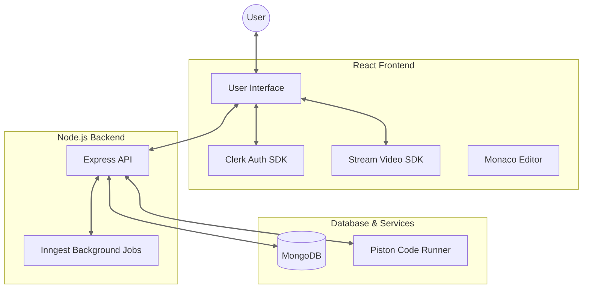

# 🗣️ Skill Sync
> **A collaborative real-time interview platform connecting developers worldwide.**


<div align="center">

[]()
[](/LICENSE)
[](./DEPLOYMENT_GCP.md)

</div>

---

## � Overview

**Conversation Canvas** is a sophisticated full-stack platform designed to simulate real-world technical interviews. It seamlessly blends **live video conferencing** with a **real-time collaborative code editor**, allowing interviewers and candidates to interact as if they were in the same room.

Built for performance and reliability, it features secure code execution, real-time synchronization, and a beautiful, modern UI.

---

## 🚀 Key Features

### 🧑‍💻 Collaborative Coding
- **Real-time Editor**: Powered by Monaco Editor (VS Code), changes sync instantly between users.
- **Multi-language Support**: Write and execute code in Javascript, Python, Java, and C++.
- **Secure Execution**: Code is run in an isolated sandbox environment for safety.

### 🎥 Interactive Communication
- **HD Video & Audio**: Crystal clear 1-on-1 calls powered by Stream SDK.
- **Screen Sharing**: Share your screen for architecture discussions or debugging.
- **Session Recording**: Record interviews for later review.

### ⚡ Developer Experience
- **Instant Feedback**: Auto-grading system with success/failure notifications.
- **Practice Mode**: Solo "Practice Problems" section to sharpen skills.
- **Dashboard**: Track past interviews and performance stats.

---

## �️ Tech Stack

<div align="center">

### Frontend


### Backend


</div>

---

## 🏗️ System Architecture



---

## 🏁 Getting Started

Follow these steps to set up the project locally.

### Prerequisites
- Node.js (v18+)
- MongoDB connection string
- Clerk & Stream API keys

### 1. Clone the Repository
```bash
git clone https://github.com/your-username/conversation-canvas.git
cd conversation-canvas
```

### 2. Backend Setup
```bash
cd backend
npm install
npm run dev
```
*Make sure to create a `.env` file referencing `.env.example`.*

### 3. Frontend Setup
```bash
cd frontend
npm install
npm run dev
```
*Make sure to create a `.env` file referencing `.env.example`.*

---

## ☁️ Deployment

We recommend **Google Cloud Run** for the best performance and free-tier benefits.

👉 **[Read the Google Cloud Run Deployment Guide](./DEPLOYMENT_GCP.md)**

Alternatively, you can deploy to Railway or Vercel:
- [Standard Deployment Guide](./DEPLOYMENT.md)

---

## 🤝 Contributing

Contributions are welcome! Please feel free to submit a Pull Request.

1. Fork the Project
2. Create your Feature Branch (`git checkout -b feature/AmazingFeature`)
3. Commit your Changes (`git commit -m 'Add some AmazingFeature'`)
4. Push to the Branch (`git push origin feature/AmazingFeature`)
5. Open a Pull Request
